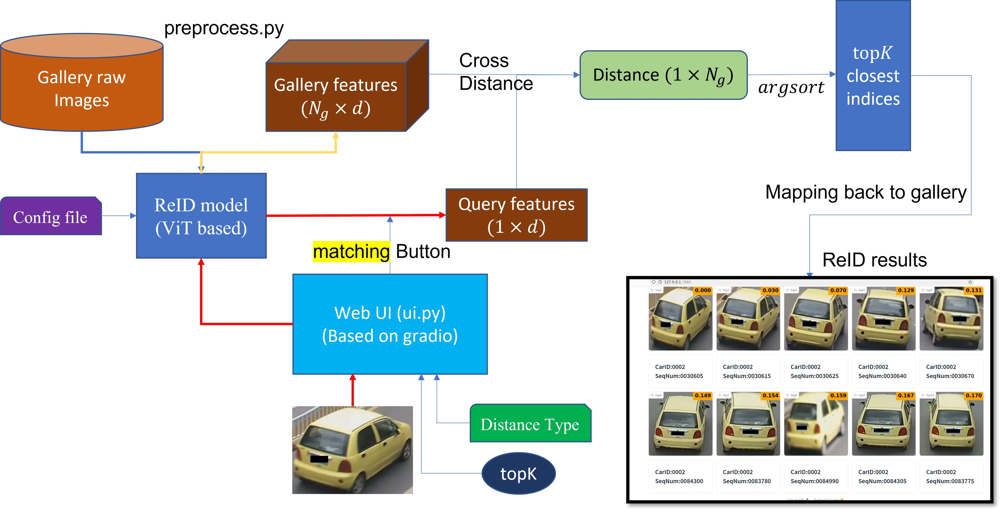

# 執行說明

## 環境
Python version : 3.10.12

### 重要之 Third Party Packages
- gradio
    - (Web UI) 之框架
- torch torchvision (cuda support)

流程圖:


## Demo 

Gallery 所有車輛的 features 都預先用 ```preprocess.py``` 算好了，存放在 : ```./precaculate/gallery```

```bash 
cd ./PTGAN (or the folder of this project)
python ui.py
```
會在 terminal 產生一條:
```
Running on local URL:  http://127.0.0.1:7860
```
使用瀏覽器開啟該 URL ，web UI 介面就會跳出

web UI 介面使用:
1. 左邊有一個可以選擇 query 車輛圖片之介面，按下他，並從
```./VehicleData/query/``` 下方挑一輛想要 ReID 的車輛
2. 設置 topk 之值，最大展示的 topk = 10, 建議設 5~6 
3. 選擇要用哪種良特徵距離的方式 (Distance type):
    - L2 distance
    - cosine distance
    - re_ranking: 
        - CVPR2017 一篇論文之 Reranking 方法 
        - (Re-ranking Person Re-identification with k-reciprocal Encoding[J]. 2017.)
        - __使用這個要跑大概 20幾秒，相比前面輛個只要 1 秒左右__
4. 以上都設置好了之後，按下 matching，就開始計算距離，算完後會在下面顯示與 query 車輛 topk $(\leq 10)$ 特徵相似之車輛

可以重複選好幾次車，只要確認 __query__, __topk__, __Distance_type__ 都有設置，按下 matching 就能夠針對當這3個設置給出結過。

結束就關掉瀏覽器頁面，直接回terminal 按下 Ctrl+C 


## ReID model 建立 與 使用 :
在 ./models/ViTReID.py 裡面，有一個 ```TransReIDBase_Inference```
的 class，就是 ReID model 

config 檔 :  ./config/transreid_256_veri_gan.yml

reid 一台車的 demo : 
python model_using_example.py 

